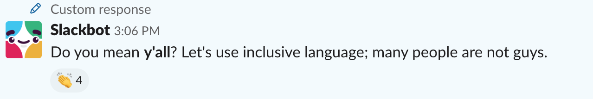

I co-host a podcast, [Soft Skills Engineering](https://softskills.audio/), with my friend [Dave Smith](https://twitter.com/djsmith42). We recently decided to create a Slack for listeners to chat about soft skills. As this group grows, it's important to me that the culture and values of the podcast also persist in to this chat room. How do you curate community and culture? I've started a few meets, run a few conferences, and started a couple of podcasts now, so I've wrestled with this problem a bit. Here are some thoughts.

## Deliberate Culture 

Whenever there is a group, there is a culture. Culture can be organic and evolved or deliberately created and curated. Like gas expanding in a vacuum takes the shape of its container, community will assume the shape of its culture. Deliberate thought gives you a chance to shape the container. Internet culture that evolves organically tends towards caustic chaos (think about what an average Facebook wall or Twitter feed or 4chan thread looks like).

## Group Size

**🚨ALERT🚨**: wild speculation on group dynamics, anthropology, sociology, etc, none of which I am an expert on.

[Dunbar's number](https://en.m.wikipedia.org/wiki/Dunbar%27s_number) hypothesizes that "humans can comfortably maintain 150 stable relationships." If true, this puts a rough upper bound on the size of communities that rely purely on relationships and convention. Beyond ~150 we might not be able to to keep models in our heads of other people or know much about them that persists beyond direct interactions. This might be why large loosely-structured communities so often devolve. As the community grows, the proportion of the community that you don't have a relationship with but still communicate grows, making it easier to misunderstand, attack, stereotype, etc. The [Eternal September](https://en.m.wikipedia.org/wiki/Eternal_September) is an early internet example of this, but I suspect that as long as humans have formed groups there have been original members decrying the loss of the original culture as the group scales beyond relationship-size.

## Deliberate Thought

Social dynamics make culture hard to scale, but I think you can counteract them with deliberate thought and structure. If you want to create and maintain a defined culture, you need to spend some brain cycles on it. What does your ideal culture look like? What kinds of messages, ideas, and interactions do you want to encourage and discourage? You should have some answers for this. It's ok if your ideas evolve over time, but thought up front will go a long way towards setting the tone for your community.

I want the Soft Skills chat to feel friendly, comfortable, inclusive, safe, and a bit whimsical. I want people to share experiences and advice with each other, joke around, and support each other.

## Writing

Now that you have some idea of what you want your community to feel like, write that down! Writing things down makes your ideas scale. It gives your group something to refer to. It helps clarify your thinking.

I made [https://softskills.audio/slack](https://softskills.audio/slack) with some communication guidelines, what folks should do when they join the chat room, and a code of conduct. I also created a slack bot that welcomes new members with a private message and reminds them to read the communication guidelines.

## Action

After thinking and writing things down, act to make it stick. Curated culture requires deliberate action to encourage or discourage certain behaviors and establish structure for interactions. Sometimes curation means clarifying rejecting behavior that doesn't fit the culture.

Within the first few weeks of setting up the chat room there was a relatively minor disagreement. It got a bit heated. I was torn between talking it out privately or addressing it in the main channel where it happened. Publicly call-outs are less comfortable and potentially embarrass the recipient. Eventually I decided re-enforcing expectations publicly was important enough to kindly address what happened. I replied with the following message in the thread:

> [Y]our comments here don't feel kind, constructive, or helpful, and feel demeaning. This is against our code of conduct ([https://softskills.audio/code-of-conduct](https://softskills.audio/code-of-conduct), specifically the section on Respect). Please work harder to communicate with respect in this slack.

 Problems that happen publicly but are handled privately give the impression that they aren’t solved, and I wanted to make it clear we care about this stuff. I don't really know the long-term effect of commenting publicly in threads like this, and I don't think the person on the receiving end enjoyed it, but I hope it clarifies expectations without making people feel ostracized for messing up.

As part of making an inclusive culture stick, I created automated replies to gently nudge towards inclusive language. So far the reaction to this has been positive - people have edited their posts to be more inclusive, no one has dogpiled on them about it, and I've seen several messages of appreciation from the community.

## Some Results

I'm very happy with the results. The community feels delightful! New members join the #intros channel and introduce themselves. A significant fraction of the members jump in to say hi in a thread for each new person that joins. People bring up questions or concerns they're facing at work, and other members weigh in with thoughtful advice or relevant experience. Small numbers make community easier (see the earlier discussion of Dunbar's number), so to some extent we're operating in easy mode, but I hope deliberate action at the beginning helps the culture scale as the community grows.

## Copy Our Stuff

Our welcome message, code of conduct and incident handling policy are on GitHub: [https://github.com/soft-skills-engineering/website/blob/gh-pages/slack.md](https://github.com/soft-skills-engineering/website/blob/gh-pages/slack.md), [https://github.com/soft-skills-engineering/website/blob/gh-pages/code-of-conduct.md](https://github.com/soft-skills-engineering/website/blob/gh-pages/code-of-conduct.md), and [https://github.com/soft-skills-engineering/website/blob/gh-pages/incident-process.md](https://github.com/soft-skills-engineering/website/blob/gh-pages/incident-process.md). We copied then from somewhere else (with attribution), so you can copy them to! We use [https://github.com/orliesaurus/greetingslack](https://github.com/orliesaurus/greetingslack) to welcome new members.

Here is our list of Slackbot replies when someone says "you guys":

<pre>
    Do you mean *team*? Let's use inclusive language; many people are not guys.
    Do you mean *folks*? Let's use inclusive language; many people are not guys.
    Do you mean *all*? Let's use inclusive language; many people are not guys.
    Do you mean *everybody*? Let's use inclusive language; many people are not guys.
    Do you mean *y'all*? Let's use inclusive language; many people are not guys.
    Do you mean *you all*? Let's use inclusive language; many people are not guys.
    Instead of *guys*, perhaps you mean *pals*? Let's use inclusive language; many people are not guys.
    Instead of *guys*, perhaps you mean *gang*? Let's use inclusive language; many people are not guys.
    Instead of *guys*, perhaps you mean *crew*? It's more inclusive than *guys*. :)
    Instead of *guys*, perhaps you mean *people*? It's more inclusive than *guys*. :)
    Instead of *guys*, perhaps you mean *y'all*? It's more inclusive than *guys*. :)
    Instead of *guys*, perhaps you mean *everyone*? It's more inclusive than *guys*. :)
    Instead of *guys*, perhaps you mean *folks*? It's more inclusive than *guys*. :)
    Instead of *guys*, perhaps you mean *fellow humans*? It's more inclusive than *guys*. :)
    Instead of *guys*, have you considered a more gender-neutral pronoun like *folks*? It's more inclusive than *guys*. :)
    Have you considered using a different pronoun instead of *guys*? Because many here (including me) aren't guys. :)
</pre>

## Community Is Everywhere

Curating culture and community applies to more than just setting up chat rooms. Community and culture applies any time a group of humans organize to do a thing. If you're starting a meetup, joining a team, forming a company, running a project, entering a bootcamp, putting on a conference, or something else, you have the opportunity to deliberately influence the community and culture.

I have plenty to learn still. What have you seen help curate community and culture? I'd love to talk more about this! You can bug me on Twitter at [@jamison_dance](https://twitter.com/jamison_dance) or email me at [hi@jamison.dance](mailto:hi@jamison.dance).
