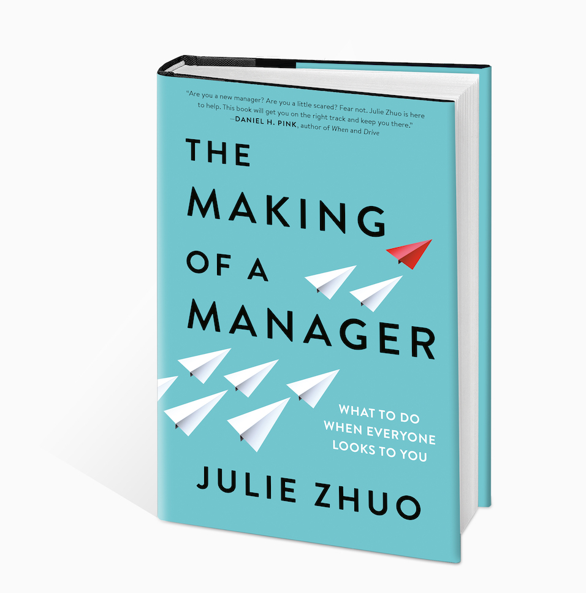
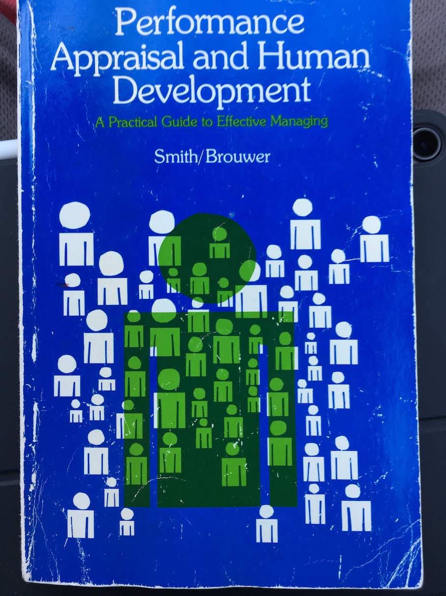
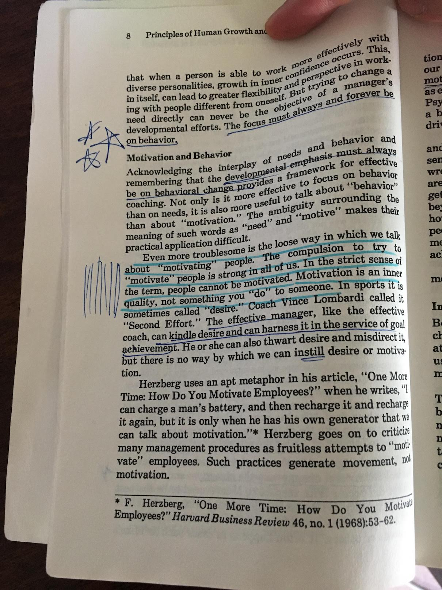

I read a fair amount about engineering management or things tangentially related to it. I really, *really* want to get better, and reading is one way I try to do that. Here are a few things I've read along with some thoughts about each one. I linked to the books I liked.

## Books I Loved

### [Radical Candor](https://www.amazon.com/Radical-Candor-Kick-Ass-Without-Humanity/dp/1250103509/)

I'm a people-pleaser. I want to be nice and I want everyone to like me. It turns out "being too nice" is a common failure mode for managers. Wanting to be nice can lead to avoiding conflict, not delivering difficult feedback, low performance, and lack of growth. Radical Candor talks about becoming direct enough to give hard feedback that helps people know where they stand and grow and improve while still caring about people.

The core metaphor is a graph with "how much you care" and "how directly you challenge" as the two axes. The idea is to both care about people and challenge them when they need to be challenged. You can fail by not caring about people and/or not challenging them.

I return to this book quite often. It's rad.

### [High Output Management](https://www.amazon.com/High-Output-Management-Andrew-Grove/dp/0679762884/)

This book was super helpful for me as a glimpse in to the mind of manager singularly focused on output. My natural tendency is to focus on people and feelings. Andy Grove is the author and long-time CEO of Intel. As the title indicates, he focuses on output. A phrase he repeats in this book is “the output of a manager is the output of their team and the teams around them.” This focus on actual measurable output and the things you do to increase it is a helpful perspective for me. Focusing on output leads to dealing with performance problems, setting clear expectations, giving good feedback, and a bunch of direct conversations that do not come naturally to me. I don’t think I’m wired like Andy Grove (few are), but I really enjoyed seeing such a different leadership style focused on getting things done first, and seeing him arrive at focusing on people in service of that goal.

### [The Manager's Path](https://www.amazon.com/Managers-Path-Leaders-Navigating-Growth/dp/1491973897)

Camille Fournier’s book is the best overview of a technical management career path I’ve read. It walks through a typical career ladder from tech lead to manager to manager of managers to director to executive explaining the job at each level. Ladders and responsibilities can vary pretty widely between companies, but this book gives a solid cross-industry baseline which I hadn’t seen before reading it. When I have questions about career path or growth I return to this book.

### [The Making of a Manager](https://www.amazon.com/Making-Manager-What-Everyone-Looks/dp/0735219567/)

A guided tour through Julie Zhou’s career at Facebook from designer to director. She is a great writer. I’ve enjoyed her [newsletter](https://www.juliezhuo.com/design/mailinglist.html) where she answers management, design and soft-skill questions, and this book is as great as I hoped it would be. She outlines her career path and talks about challenges and things she learned at each level grounded in very practical real-world experience. I took several pages of notes from this book. It feels immediately applicable. Highly recommended.

### [Performance Appraisal and Human Development](https://www.amazon.com/Performance-Appraisal-Human-Development-Practical/dp/0201074559)

This book is basically about how to evaluate performance, deliver clear feedback on performance, and coach to improve performance. My dad gave me this book when I was struggling with giving clear feedback to my team. It was fun to read through and see his marginalia from when he was my age.

<figure>
  
  <figcaption>My dad's highlighting style involves lots of scribbles.</figcaption>
</figure>

I suspect giving clear feedback on performance will be an eternal struggle, but this book helped me get better. It’s from the 1977 but I was surprised by how relevant it still felt. It was refreshingly free from hype or spin or sales pitches growth-hacking marketing speaker that inhabits modern business writing.

Performance feedback is about behavior, not psychology. It’s very hard to change essential characteristics of a person. If your feedback is based on who they *are* (“you seem to lack confidence”), instead behavior is that is contributing to poor performance (“when your ideas are challenged in meetings, you don’t defend them which makes it seem like you don’t support them strongly”), it’s much harder for the recipient to act on. Focus on behavior, since it gives clear direction on what to improve - you change the behavior.

### [The Coward's Guide To Conflict](https://www.amazon.com/Cowards-Guide-Conflict-Empowering-Solutions/dp/1402200552)

There is a theme here. Another book on dealing with conflict, but this one felt much more applicable and practical than Crucial Conversations. I'm glad I didn't judge it by the cover, because it looks pretty cheesy.

From this book I learned that conflict is unavoidable, so a strategy of avoiding conflict doesn’t work out long term. You can strongly dislike it, be intimidated by it, get nervous around it, and still do a good job productively working through conflict. Avoiding conflict leads to not addressing important issues on a team or project, which makes teams less healthy and makes projects fail.

## Highly Recommended But Not My Jam

### The E-Myth Manager

A boss asked the whole team to read this book. I *hated* it. I think the thesis of the book was that we need to be more empowered somehow? I can’t remember any of it, because all I can remember is how stupid the business fable at the center of this book was. It was basically some wise elder executive taking an eager young pup under his wing, answering questions like “Golly gee, how did you ever manage to unite the team and produce more shareholder value?” Then the wise elder executive would take the young pup out golfing, sit majestically on the golf cart, and tell a story about synergy or something. Incredibly cheesy and contrived and patronizing. It turns out I really don’t like story-driven business books, because most business writers are not good storytellers. It just feels like reading bad Jack Welch fan-fiction.

### Five Dysfunctions of a Team

I do not remember what the five dysfunctions of a team are. I read this right when I started my current job, and for some reason none of it stuck in my head. I think there was something about trust? Again, it felt very fable-based instead of principle-based or pragmatic.

### The Dev-Ops Handbook

This book felt like mostly styrofoam, and the nuggets of good stuff were interspersed in with lots of fluff. Maybe I’m not the audience for the book. I could see it being more useful for leadership at large companies trying to get up to speed, but it felt overly vague and obvious to me.

### Measure What Matters
This book would be a great [blog post](https://medium.com/startup-tools/okrs-5afdc298bc28), and is a great [one-hour talk](https://www.youtube.com/watch?v=mJB83EZtAjc). It is a very fluffy book. The basic idea is great. You should use objectives and key results (OKR's) to structure your work. You should be setting broad goals ("objectives") with measurable intermediate steps ("key results") to achieve those goals, and you should be periodically evaluating both your broad goals and your intermediate steps. There are some other ideas about cascading these throughout the org chart, so theoretically your objectives help fulfill your boss's key results. This idea is from Andy Grove, and he talks about it in High Output Management, a better book all-around that you should read instead. The rest of this book is back-patting stories about the magic of setting goals, including a particularly cringe-worthy triumphant success story about how YouTube obsessed over getting to one billion hours of watch time as a measurable metric of success.

> Our job was to keep people engaged and hanging out with us. By definition, viewers are happier watching seven minutes of a ten-minute video (or even two minutes of a ten-minute video) than *all* of a one-minute video.

WAT

They prioritized longer videos in recommendations, tweaked their recommendation algorithms to optimize for watch time, cursed the summer because people went outside more and spent less time on YouTube, and maybe accidentally led to the rise in modern extremism. But hey, at least they achieved their key result of increasing watch time! Ok, gotta move on before I turn this in to a rant about engagement. Anyways, read the blog posts about OKR's, but maybe skip the book.

### Crucial Conversations

I want to get better at hard conversations - conversations with strong underlying disagreement, or where people don’t get along, or where the outcome could be painful to one or both sides. I’ve read this book a few times because its promise sounds so enticing - what if these conversations weren’t so stressful and awful? What if I felt good about the outcome? Unfortunately, I haven’t been able to apply the advice in this book successfully yet. It felt very fuzzy and impractical. A phrase that recurs in the book is “the shared pool of meaning”, which refers to the shared understanding the two people having the conversations have. You’re supposed to add to the shared pool of meaning which will make it easier to resolve conflict and discuss hard things. In hard conversations I haven’t found the problem to be easily solved by coming back to what we had in common, since usually these conversations stem from some deep conflict in personalities or values.

For each of these books I know smart people who love them, but they were not for me.

## Others I’ve Enjoyed

- [The Mythical Man Month](https://www.amazon.com/Mythical-Man-Month-Software-Engineering-Anniversary/dp/0201835959)
- [Good Strategy, Bad Strategy](https://www.amazon.com/Good-Strategy-Bad-Difference-Matters/dp/0307886239)
- [The Effective Executive](https://www.amazon.com/Effective-Executive-Definitive-Harperbusiness-Essentials/dp/0060833459/)

I’m always looking for new recommendations. What books have you enjoyed?
