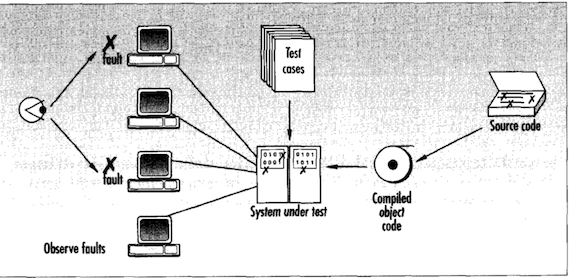

A while ago I read a post that included the following quote:

> Each hour spent on code review saves 33 hours of maintenance.

This struck me as suspicious. I mistrusted the exactness, certainty, and magnitude. Software engineering is a fuzzy field and absolutes and exact numbers are not often found in the research. I decided to dig in to understand where this number came from. Thankfully, the author cited a source: Russell, Glen W. “Experience with Inspection in Ultralarge-Scale Developments,” IEEE Software, Vol. 8, №1 (January 1991), pp. 25–31. Let’s check it out!

## The Source

The article is behind a paywall, but oh my gosh, a stranger just bumped in to me and in the confusion this link was knocked out of their stylish briefcase and fell on the ground in front of me: [https://cyber.sci-hub.se/MTAuMTEwOS81Mi42MjkyOQ==/russell1991.pdf](https://cyber.sci-hub.se/MTAuMTEwOS81Mi42MjkyOQ==/russell1991.pdf). Weird, the stranger disappeared as suddenly as they arrived! Oh well, let’s dig in to the article and see what it says.

The first thing that jumped out is that the source is not a peer reviewed scientific study. It’s the equivalent of a blog post from 1991. Blog posts are great (like this one, hopefully?), but someone writing an article in a journal isn’t a stamp of absolute truth.

## Code Inspection

I also noticed the source is about code inspection which is pretty different from the modern form of code review. Page 25 of the article describes code inspection. It’s an in-person group exercise where a team of at least three people (moderator, one or more inspectors, and the code author) go through a section of code line by line, paraphrasing what every line should do. The article recommends inspectors attend overview meetings, read design docs, and generally put in some time to prepare for the code inspection. The article suggests a maximum pace of 150 lines of code inspected per hour. This is a very time-consuming process for several people. Code inspection is much more exhaustive than the modern idea of code reviews on pull requests, where the expectations are usually unclear but generally call for a much lower amount of time put in by the reviewer. The difference between modern code review and code inspection as described in the article make me a more suspicious of the claim that an hour of code review saves 33 hours of maintenance. Let’s keep reading.

## Some Details on 33 Hours

The article is about code inspections at Bell-Northern Research, a company that made telecom switches. I imagine these are pretty specialized and expensive pieces of hardware.

The author’s company used code inspection on a relatively large project and tracked the number of defects found.

> [I]nspections [...] yielded between 0.8 and 1 defect per [person]-hour.

The author then compares this cost to the cost of finding and fixing defects in the field.

> Statistics collected from large BNR software projects show that each defect in software released to customers and subsequently reported as a problem requires an average of 4.5 man-days to repair. Each hour spent on inspection thus avoids an average of 33 hours of subsequent maintenance effort, assuming a 7.5-hour workday.

Here we come to the source of the 33 hours number. The author is comparing the average number of person-days to fix defects in these deployed switches, doing some QUICK MATHS to convert it to hours, and presenting that number.

There are a few issues with taking that number and turning in to a statement like “one hour of code review saves 33 hours of maintenance.”

1. That comparison assumes each defect found would take roughly the average time to fix. Maybe code inspection only finds defects that would take less time to fix, or maybe it only finds the really gnarly bugs that would take more time to fix. That 4.5 person-days number might be too low, or too high.
2. It assumes code inspection would have found the defects reported by customers. That’s begging the question. Maybe customer-reported defects are a totally different class than code inspection defects. The author even states in the article that “Inspection and testing are implement complementary because each technique uncovers different types of errors.” Developers are pretty good at understanding normal behavior under expected conditions, but developer expectations pretty often don’t match what actually happens in the real world. I routinely encounter bugs  where the system breaks in situations I’d never imagine it to be in.
3. Most of us aren’t working on telecom switches in the 1980s or doing formal code inspection as described in the article. The maintenance time might include the time to drive out to the hardware and apply a patch for all we know! I think it is much easier to deploy a fix to a SaaS product or web-based software than a switch from the 1980s, and I suspect most code review processes are less efficient at finding bugs than code inspection. The one hours - 33 hours applies in very specific situations and context, and applying it outside that context is extrapolating.

## The Source Is Good!

I’m glad I read the underlying source. It’s got some interesting ideas! Code inspection is a neat idea, and reading the article raised some questions for me. Given how effective inspection seems, should we be spending more time on code reviews than we do? How much time? How do we set clear expectations about how much time and effort we should be taking in code reviews? Should we be tracking defects found in code reviews? Later the author compares how efficient code inspection is at finding defects compared to “system testing”. The author includes this rad clip-art diagram describing system testing.

From the diagram, “systems testing” looks like executing test cases (maybe manual, maybe automated?) on a real system running in a production-like environment. The author reports code inspection finds twice as many defects as system testing. Maybe we should be focusing more time on code reviews compared to testing? These are all interesting things to think about.

## Conclusion

I think it's important to question suspicious quotes. Find the sources for claims and read them, or doubt those claims if there are no sources provided. Software development is fuzzy and mostly based in folklore. By checking sources, we can push for a bit more data so we’re at least telling historical fiction instead of developer fables.

If you like empirical research in to software engineering, you might enjoy [@hillelogram](https://twitter.com/hillelogram/) ([https://hillelwayne.com/talks/what-we-know-we-dont-know/](https://hillelwayne.com/talks/what-we-know-we-dont-know/) is great, his twitter feed is great, his blog is great) and [@danluu](https://twitter.com/danluu) ([https://danluu.com/deconstruct-files/](https://danluu.com/deconstruct-files/) and [https://danluu.com/empirical-pl/](https://danluu.com/empirical-pl/) are great, but also his twitter feed).
