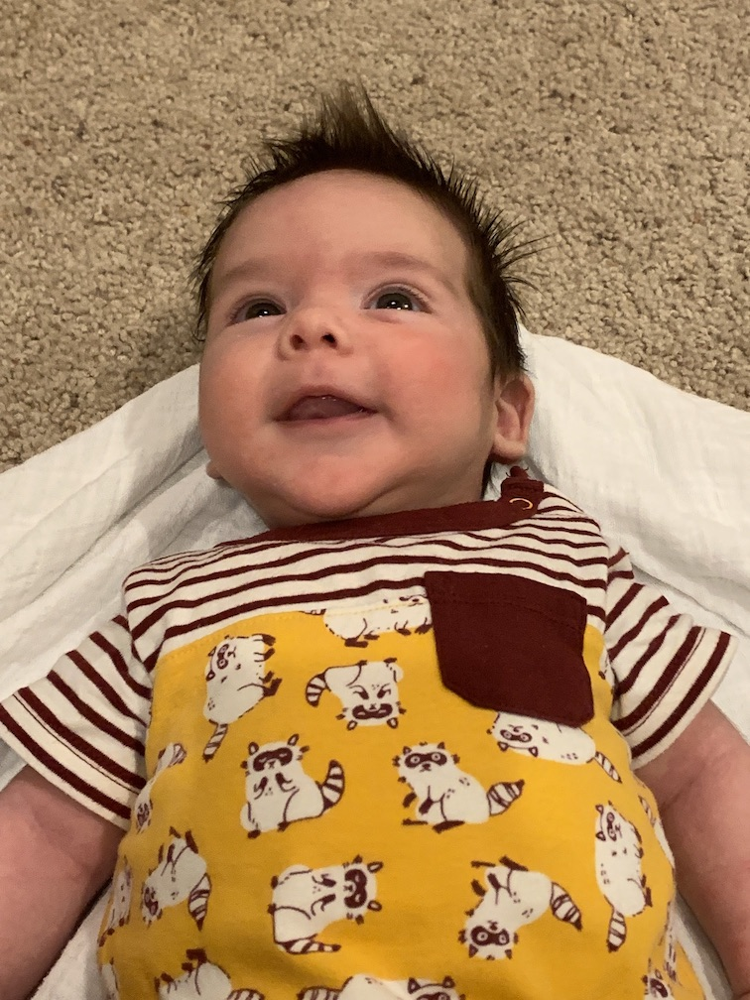

I recently took six weeks of paternity leave. Paternity leave is rad! The kiddo and mom are doing great.

Coming back to my work inbox was not great. While on leave I received ~8,000 emails that weren't filtered by my existing rules. 43 emails were actionable or worth reading. That's 0.5%. Those 43 emails were pretty important, so I can't just ignore all email. For reasons I can’t just unsubscribe from all those emails. That means I'm trapped in a nightmare of clicking rectangles to make numbers go down. Email is effectively useless if 99.5% of messages are junk, but I still have to sift through them all because some of them are **very** important.

Email should be the system of record for decisions and announcements. If instead email is mostly noise, it’s tougher to share important things. You have to turn to the [frantic buzz of chat](https://m.signalvnoise.com/is-group-chat-making-you-sweat/) or maybe just yell really loudly in the office. What can I do about this? How can I increase the signal in email and make it more helpful?

After talking to my boss and poking around the Internet for advice, I came up with a solution. Previously I was trying a block list. Each time I got an email that seemed less than useful, I’d create a rule to filter out emails like that in the future. Instead I moved to an allow list to make sure I focused on emails I knew were important and just skimmed everything else. I set up three folders: one for my reports, one my boss and their bosses, and one for everything I'm CC'd on.

I check the folders for my bosses and reports a few times a day. I want to be responsive to those folks. I check the CC folder once per day. This is straight from [Scott Hansleman](https://www.hanselman.com/blog/OneEmailRuleHaveASeparateInboxAndAnInboxCCToReduceEmailStressGuaranteed.aspx). I read the rest of my inbox every once in a while. This has drastically cut down on the amount of time I spend clicking the delete button, which has also taken away one of the great sources of joy in my life, which is reading things and then knowing I don’t have to do anything because of them. I think I’ll survive.

There is a chance I’ll miss something very important. That chance is already there now, and also I spend much less time flailing in a loop between email and chat, just making numbers get smaller forever without actually getting anything done. This helps me sift the important from the less important and stem the endless flow of distraction. What have you found useful for reclaiming email?
